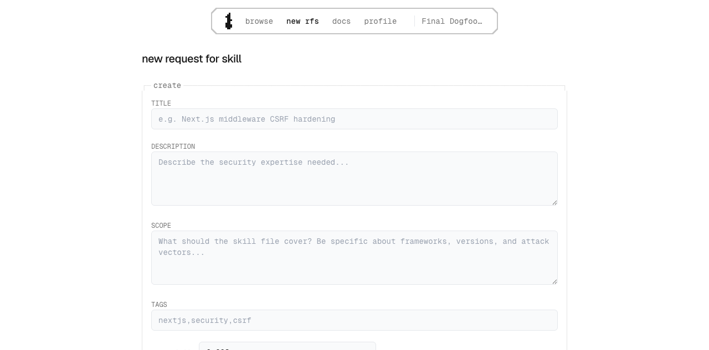
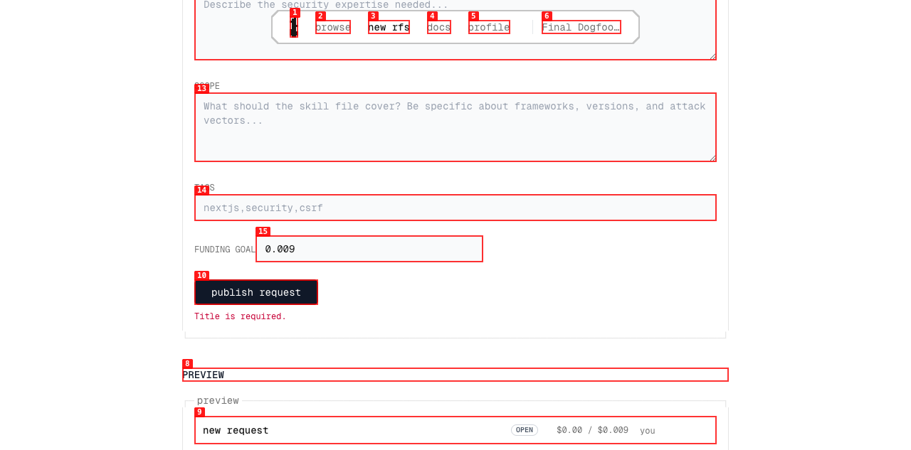
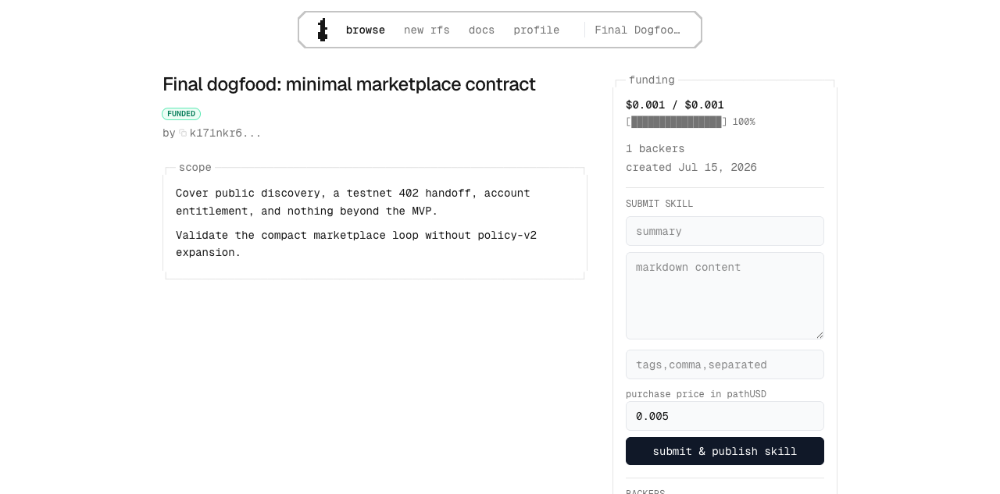
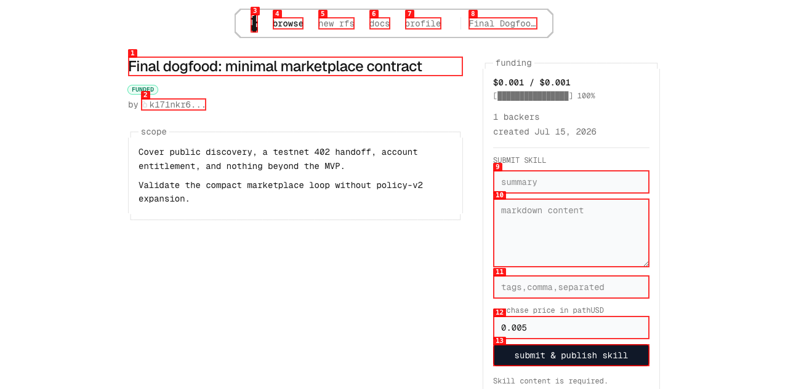
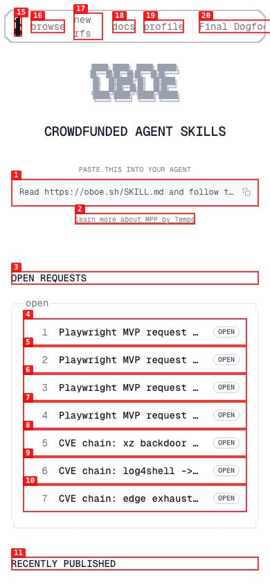
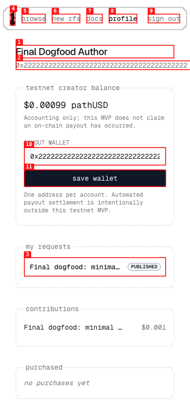

# Oboe marketplace MVP dogfood

| Field | Value |
|---|---|
| **Date** | 2026-07-15 |
| **App URL** | `http://127.0.0.1:3100` (production build) |
| **Session** | `oboe-mvp-dogfood` |
| **Scope** | Current marketplace MVP: public catalog, auth, create/fund/claim/submit/publish, entitlement/purchase handoff, wallet persistence, desktop/mobile UX |

## Summary

| Severity | Count |
|---|---:|
| Critical | 0 |
| High | 0 |
| Medium | 0 |
| Low | 0 |
| **Unresolved total** | **0** |
| Resolved during pass | 4 |

## Issues

### ISSUE-001: Empty RFS form waits for server validation

| Field | Value |
|---|---|
| **Severity** | low |
| **Category** | UX / functional |
| **URL** | `http://127.0.0.1:3100/new` |
| **Repro video** | [issue-001-empty-rfs.webm](mvp-dogfood-20260715/videos/issue-001-empty-rfs.webm) |
| **Status** | Resolved and regression-tested |

**Description**

Submitting the untouched RFS form sends a request and briefly shows `publishing...` before the server responds with `Title is required.` The backend rejects the write correctly, but the title, description, and scope fields should use native required-field validation so an obviously incomplete form is blocked without a network roundtrip.

**Repro steps**

1. Open the empty authenticated RFS form.
   
2. Select **publish request** without entering any text.
3. Observe the delayed server-side error rather than immediate required-field validation.
   

**Resolution**

The title, description, scope, and funding-goal controls now use native required-field validation. Repeating the empty submit focuses `rfs-title` and captures no `/api/rfs` request. The authenticated Playwright flow asserts all four constraints. [Fixed-state evidence](mvp-dogfood-20260715/screenshots/10-required-validation-fixed.png).

### ISSUE-002: Empty skill form waits for server validation

| Field | Value |
|---|---|
| **Severity** | low |
| **Category** | UX / functional |
| **URL** | `http://127.0.0.1:3100/browse/k170ycjck3mhvdfhy2rnjw4y998aj0me` |
| **Repro video** | [issue-002-empty-skill.webm](mvp-dogfood-20260715/videos/issue-002-empty-skill.webm) |
| **Status** | Resolved and manually regression-tested |

**Description**

After claiming a funded RFS, selecting **submit & publish skill** with untouched summary/content fields sends a request and waits for the server to return `Skill content is required.` The backend correctly rejects the write, but required submission fields should block locally.

**Repro steps**

1. Claim a funded RFS and leave its submit form untouched.
   
2. Select **submit & publish skill**.
3. Observe the delayed server error rather than native required-field validation.
   

**Resolution**

The submission controls now form a real HTML form, with summary, Markdown content, and purchase price required. Repeating the empty submit focuses `skill-summary` and captures no submit request. [Fixed-state evidence](mvp-dogfood-20260715/screenshots/18-skill-required-fixed.png).

### ISSUE-003: Signed-in mobile header clips the account action

| Field | Value |
|---|---|
| **Severity** | low |
| **Category** | visual / responsive UX |
| **URL** | `http://127.0.0.1:3100/` |
| **Repro video** | N/A (visible on load) |
| **Status** | Resolved and regression-tested |

**Description**

At a 390 px viewport, the authenticated header measures 399 px and clips the long `Final Dogfood Author (sign out)` control at the right edge. The public page itself is responsive; the overflow is specific to the signed-in navigation state.

**Repro**

1. Sign in and open the home page at 390 × 844.
2. Observe the clipped account action and horizontal document overflow.
   

**Resolution**

The mobile account action is now the explicit label `sign out`; the account name remains visible on larger screens. A long-display-name Playwright case and the direct browser both measure the signed-in document at exactly 390 px. [Fixed-state evidence](mvp-dogfood-20260715/screenshots/22-auth-mobile-header-fixed.png).

### ISSUE-004: Saved wallet address adds mobile overflow

| Field | Value |
|---|---|
| **Severity** | low |
| **Category** | visual / responsive UX |
| **URL** | `http://127.0.0.1:3100/me` |
| **Repro video** | N/A (visible on load) |
| **Status** | Resolved and regression-tested |

**Description**

At a 390 px viewport, the profile measures 393 px after a full EVM wallet is saved. The top wallet copy control renders the 42-character address on one line and extends just beyond the right edge.

**Repro**

1. Save a payout wallet, reload `/me`, and set the viewport to 390 × 844.
2. Observe the clipped wallet copy control and three pixels of document overflow.
   

**Resolution**

The copy control now has a constrained flex width and truncates only its visual label; clicking still copies the complete address. Both Playwright and the direct browser now measure the profile at exactly 390 px. [Fixed-state evidence](mvp-dogfood-20260715/screenshots/25-profile-mobile-fixed.png).

## Validation evidence

### Scope conclusion

The current product is a compact marketplace MVP, not the policy-v2 platform described by the former production audit. Its acceptance surface is public discovery plus create, fund, claim, submit/auto-publish, entitlement/purchase, basic auth, and one payout wallet. API keys, delegation/recovery, applications, rankings, bonds, reviewer/evaluation systems, disputes, evidence/reputation, operations consoles, automated settlement, and mainnet are not current release criteria.

The former report is preserved as the [archived policy-v2 audit](archive/policy-v2-production-dogfood-20260715.md), not deleted or silently rewritten.

### Browser coverage

| Journey | Result | Evidence |
|---|---|---|
| Public home, catalog, status/text search, docs | Pass; no console/page errors | [home](mvp-dogfood-20260715/screenshots/01-home-desktop.png), [browse](mvp-dogfood-20260715/screenshots/02-browse-desktop.png), [search](mvp-dogfood-20260715/screenshots/03-browse-search.png), [docs](mvp-dogfood-20260715/screenshots/06-docs-desktop.png) |
| Signed-out metadata and purchase handoff | Pass; preview only, valid 402 command, copy feedback | [detail](mvp-dogfood-20260715/screenshots/04-published-signed-out.png), [402 handoff](mvp-dogfood-20260715/screenshots/05-purchase-402-handoff.png) |
| Auth boundaries | Pass; profile explains auth and `/new` redirects with `next=/new` | [profile](mvp-dogfood-20260715/screenshots/07-profile-signed-out.png), [sign-in](mvp-dogfood-20260715/screenshots/08-sign-in.png) |
| Create account and RFS | Pass; redirect target preserved, preview and persisted RFS correct | [authenticated form](mvp-dogfood-20260715/screenshots/09-new-authenticated.png), [filled preview](mvp-dogfood-20260715/screenshots/11-new-preview-filled.png), [created RFS](mvp-dogfood-20260715/screenshots/12-created-rfs.png) |
| Wallet validation/persistence | Pass; invalid value blocked locally, valid wallet survives reload, settlement disclaimer visible | [before](mvp-dogfood-20260715/screenshots/14-profile-before-wallet.png), [persisted](mvp-dogfood-20260715/screenshots/15-wallet-persisted.png) |
| Signed-in fund -> claim -> submit -> auto-publish | Pass with a real 0.001 pathUSD transfer; bound account appears as backer | [fund handoff](mvp-dogfood-20260715/screenshots/13-signed-in-fund-handoff.png), [funded](mvp-dogfood-20260715/screenshots/16-funded-account-bound.png), [claim](mvp-dogfood-20260715/screenshots/17-claimed-submit-form.png), [published](mvp-dogfood-20260715/screenshots/19-auto-published.png) |
| Author/backer entitlement | Pass; full Markdown returns without a second payment | [author entitlement](mvp-dogfood-20260715/screenshots/20-author-entitlement.png) |
| Separate buyer purchase and persistent entitlement | Pass with a real 0.001 pathUSD transfer; profile records the purchase | [before](mvp-dogfood-20260715/screenshots/26-buyer-before-purchase.png), [content](mvp-dogfood-20260715/screenshots/27-buyer-entitlement.png), [profile](mvp-dogfood-20260715/screenshots/28-buyer-profile-purchase.png) |
| Authenticated mobile home/detail/profile | Pass at 390 × 844 with no horizontal overflow after fixes | [home](mvp-dogfood-20260715/screenshots/22-auth-mobile-header-fixed.png), [detail](mvp-dogfood-20260715/screenshots/23-published-mobile.png), [profile](mvp-dogfood-20260715/screenshots/25-profile-mobile-fixed.png) |

### API and authorization probes

- Public skill metadata for `k570cxz15tj5braed5b7rddf2x8akjn9` returned price `"1000"` and no `contentMarkdown` at either the top level or nested skill object.
- Anonymous content returned `402`; the same route returned `200` to the entitled author and buyer.
- Anonymous claim returned `401`.
- An authenticated claimant's attempt to replace an already published skill returned `409 INVALID_STATE`; publication is terminal in the MVP.
- Malformed public RFS ID returned `404` with `{ status: "error", code: "NOT_FOUND", message: "RFS not found." }`.
- Small bigint amounts serialize as strings, and the UI renders 0.001/0.00099 values without rounding them to 0.00.
- Creator accounting was read back as `0.00198` pathUSD, proving the profile total includes both the 990-base-unit funding share and the 990-base-unit purchase share.

### Completion audit hardening

- A global payment-event guard now rejects reusing one verified challenge across funding and purchase, while preserving exact recording retries.
- A closed RFS can accept an already-paid retry, but any response that would issue a fresh 402 challenge is replaced with `409 INVALID_STATE`; clients cannot be invited to fund it again.
- Direct Convex writes now enforce Moderato pathUSD and the `1..9000` base-unit payment range, so bypassing a Next route cannot create an unfundable or non-Moderato listing.
- Passkey auth, funding-based rank UI, and unreachable policy-era lifecycle/grant/payout variants were removed. The implemented surface now matches the email/password, newest-first marketplace contract.

### Tempo Moderato settlement evidence

Every charge used chain `42431`, pathUSD `0x20c0000000000000000000000000000000000000`, and escrow `0xd9D633c71968410c6812d0849a665ab1F93C5841`. Each individual charge was below `$0.01`.

| Actor/path | Amount | Application result | Transaction | RPC proof |
|---|---:|---|---|---|
| Independent funding agent | 1000 base units | contribution `j97bew0w16z7zjm4nth6zpttwx8ak2vs`; RFS remained open | `0xc5839b70e6aff33e21a2088796dc64edcea8c911b9097dce8e90bbfa2fdf7b37` | status `0x1`; exact transfer to escrow |
| Independent buying agent | 5000 base units | purchase `jx7b6t4vb5h4s1v5raj2pdw39s8aj852`; full Markdown returned | `0x45038555fb99998881c6442279b880c41c09a4a5621c39f0815a9c7efa560ec8` | status `0x1`; exact transfer to escrow |
| Direct-browser author funding | 1000 base units | contribution `j970atebzs77k10nkrg0frtzks8aj5dh`; next state `funded` | `0xb026063b81ce0b72374d1b6f111f261161a418490a08582b46fad07ffdf25269` | status `0x1`, block `0x196ded0`; exact transfer to escrow |
| Direct-browser buyer purchase | 1000 base units | purchase `jx7d2ecd0cfftvrsmcdzv4kf518akzx8`; account entitlement persisted | `0x605fc7895107b68ee58636307c6ae6a6acce701bb6822d8c0c98bdb43402da7f` | status `0x1`, block `0x196e237`; exact transfer to escrow |

The escrow balance after all browser and agent QA payments was 10,000 base units (0.01 pathUSD). This is custody evidence only; automated creator payout settlement remains explicitly outside the MVP.

A final 1-base-unit probe against the rebuilt artifact encountered the official Moderato RPC error `no healthy upstreams available` during local signing. The hardened helper aborted before sending an authorized retry; both the RFS total and escrow balance remained unchanged. This external failure is not counted as a payment above and did not produce a false application success.

### Automated and build evidence

| Check | Result |
|---|---|
| Vitest | 14 files, 36 tests passed, including a three-case local transport harness for the payment helper |
| Playwright | 3/3 passed against the production build: public redaction/accessibility, four signed-out mobile routes, and authenticated wallet/create/402/mobile/sign-out flows |
| Accessibility | No serious or critical WCAG 2 A/AA Axe violation in the covered catalog/authenticated detail states |
| TypeScript | `tsc --noEmit` passed |
| ESLint | passed |
| Production build | Next 16.2.10 build passed; 10 API route handlers and 7 product pages |
| Convex | narrowed schema and functions prepared successfully on isolated dev deployment `tidy-salmon-662`; obsolete payout-claim index deleted |
| Payment script | `bash -n` and `--help` passed; requires a valid MPP credential, `Payment-Receipt`, and Oboe `status: "ok"` result before reporting success |
| Dependency audit | `npm audit --omit=dev`: 0 vulnerabilities after the PostCSS 8.5.16 compatibility override |
| Diff hygiene | `git diff --check` passed |

One local performance sample recorded home FCP 140 ms / TTFB 102 ms / CLS 0.0004 and authenticated detail FCP 584 ms / TTFB 496 ms / CLS 0.0004. These are local production-build observations, not a public-host SLA.

### Remaining launch caveats

- This is a local production build connected to a separate Convex development deployment, not a production rollout.
- Do not deploy the narrowed schema over the previous policy-v2 production deployment without a reviewed backup and migration.
- Rotate test secrets and choose production custody/payout operations before a public launch.
- Mainnet acceptance and automated payout settlement remain intentionally disabled and out of scope.
